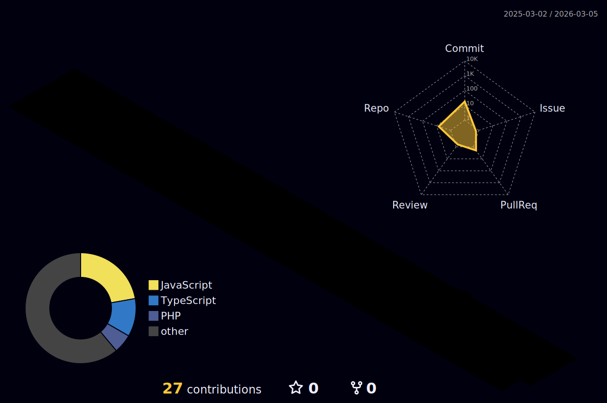
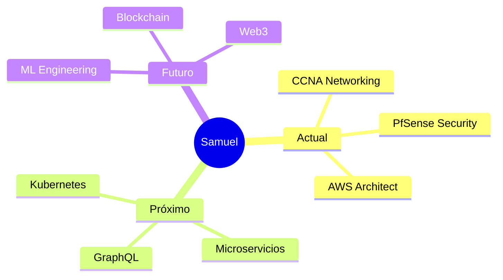

<div align="center">

<!-- ANIMATED TYPING HEADER -->
<a href="https://git.io/typing-svg"></a>

<br/>

<!-- ANIMATED WAVE -->


</div>

---

<div align="center">

### 💫 Desarrollador Web | Arquitecto de Soluciones | Innovador Tecnológico

</div>

<div align="center">
  
[](https://www.linkedin.com/in/samuel-s%C3%A1nchez-terr%C3%B3n-78563a33b/)
[](mailto:sanchez.sm2002@gmail.com)
[](https://github.com/TU_USUARIO)

</div>

---

<!-- ANIMATED CODING GIF -->


### 🚀 Sobre mí

```typescript
const Samuel = {
  ubicación: "Villa Guerrero, México 🇲🇽",
  educación: "Ing. Sistemas Computacionales",
  enfoque: ["Full-Stack Dev", "Real-Time Systems", "Cloud Architecture"],
  
  actualmenteAprendiendo: {
    redes: "CCNA Fundamentals",
    seguridad: "PfSense Firewall",
    arquitectura: "Software Design Patterns",
    automation: "AI-Powered Tools"
  },
  
  código: [TypeScript, JavaScript, PHP, Python],
  tecnologías: {
    frontend: ["React", "Next.js", "TailwindCSS"],
    backend: ["Node.js", "Laravel", "Prisma"],
    databases: ["PostgreSQL", "MongoDB", "MySQL"],
    cloud: ["AWS (EC2, S3, RDS)", "Docker"],
    realTime: ["WebSockets", "SSE", "Three.js"]
  },
  
  desafíoActual: "Construir sistemas escalables que cambien vidas 🌟"
};
```

<br clear="right"/>

---

## 🛠️ Arsenal Tecnológico

<div align="center">

### Frontend & UI/UX
<p>
  
</p>

### Backend & Databases
<p>
  
</p>

### Cloud & DevOps
<p>
  
</p>

### Tools & Others
<p>
  
</p>

</div>

---

## 🔥 Estadísticas y Actividad

<div align="center">

<!-- GITHUB STREAK STATS -->


</div>

<br/>

<div align="center">

<!-- GITHUB STATS -->


<!-- MOST USED LANGUAGES -->


</div>

---

## 🏆 Logros de GitHub

<div align="center">

<!-- GITHUB TROPHIES -->


</div>

---

## 📊 Gráfico de Contribuciones 3D

<div align="center">

<!-- 3D CONTRIBUTION GRAPH - Necesitarás configurar GitHub Actions para esto -->


</div>

---

## 🐍 Contribuciones Animadas

<div align="center">

<!-- SNAKE EATING CONTRIBUTIONS - Necesitarás configurar GitHub Actions para esto -->
<picture>
  <source media="(prefers-color-scheme: dark)" srcset="https://raw.githubusercontent.com/TU_USUARIO/TU_USUARIO/output/github-contribution-grid-snake-dark.svg">
  <source media="(prefers-color-scheme: light)" srcset="https://raw.githubusercontent.com/TU_USUARIO/TU_USUARIO/output/github-contribution-grid-snake.svg">
  
</picture>

</div>

---

## 💼 Proyectos Destacados

<div align="center">

### 🗺️ Sistema de Monitoreo en Tiempo Real
**Stack:** Next.js • Prisma • PostgreSQL • Mapbox • SSE
<br/>
Sistema de tracking vehicular con visualización en tiempo real y procesamiento de telemetría continua.

[](https://github.com/TU_USUARIO/nombre-repo-tracking)

---

### 🍽️ Plataforma de Pedidos Digitales
**Stack:** Laravel • MySQL • Twilio • WhatsApp API
<br/>
Sistema completo de gestión con notificaciones automáticas y panel administrativo intuitivo.

[](https://github.com/TU_USUARIO/nombre-repo-pedidos)

</div>

---

## 📈 Actividad de Desarrollo

<div align="center">

<!-- GITHUB ACTIVITY GRAPH -->


</div>

---

## 💡 Experiencia Profesional

<div align="center">

### **Flores y Planas la Finca S.A. DE C.V.**
*Desarrollador Web Full-Stack & Operaciones Digitales*

</div>

<details>
<summary><b>🎯 Logros Destacados (Click para expandir)</b></summary>
<br/>

- ✅ **Optimización del 70%** en precisión de entrega del sistema de empaque
- 🔄 **Reestructuración completa** de inventarios digitales
- 📊 **Implementación de monitoreo** en tiempo real para flotas vehiculares
- 🚀 **Digitalización** de procesos del sector alimenticio
- ☁️ **Despliegue y gestión** en AWS con alta disponibilidad
- 👥 **Coordinación de equipos** para cumplimiento de objetivos

</details>

---

## 📚 Aprendizaje Continuo

<div align="center">



</div>

---

## 🌟 Filosofía de Código

<div align="center">

```javascript
while (alive) {
  eat();
  sleep();
  code();
  repeat();
}

// "Código limpio es código que cuenta historias"
// "La mejor optimización es escribir código que no necesites optimizar"
// "Siempre hay espacio para mejorar"
```

</div>

---

## 📬 Conecta Conmigo

<div align="center">

<table>
  <tr>
    <td align="center" width="200px">
      <a href="https://www.linkedin.com/in/samuel-s%C3%A1nchez-terr%C3%B3n-78563a33b/">
        
        <br/><b>LinkedIn</b>
      </a>
    </td>
    <td align="center" width="200px">
      <a href="mailto:sanchez.sm2002@gmail.com">
        
        <br/><b>Email</b>
      </a>
    </td>
    <td align="center" width="200px">
      <a href="https://github.com/TU_USUARIO">
        
        <br/><b>GitHub</b>
      </a>
    </td>
  </tr>
</table>

</div>

---

## 🎯 Metas 2025

- [ ] 🏅 Certificación CCNA
- [ ] 📖 Contribuir a 5+ proyectos Open Source
- [ ] 🚀 Lanzar mi propio producto SaaS
- [ ] 📝 Escribir 12 artículos técnicos
- [ ] 🎓 Aprender arquitectura de microservicios
- [ ] 💪 Alcanzar 1000+ commits este año

---

<div align="center">

### 💬 Quote del Día

<!-- GITHUB README QUOTES -->


</div>

---

<div align="center">

### 🎵 Actualmente Escuchando

<!-- SPOTIFY NOW PLAYING -->
<!-- Descomenta si conectas Spotify -->
<!-- 

-->

</div>

---

<div align="center">

### 👁️ Visitas al Perfil


<br/><br/>

### ⭐ Si te gusta mi trabajo, considera dar una estrella a mis repositorios


</div>

---

<div align="center">

```ascii
╔══════════════════════════════════════════════════════════════╗
║                                                              ║
║  "El código es poesía"                                       ║
║  "Cada bug es una oportunidad de aprender"                   ║
║  "La innovación distingue a los líderes de los seguidores"  ║
║                                                              ║
╚══════════════════════════════════════════════════════════════╝
```

### 🚀 Siempre abierto a nuevas oportunidades y colaboraciones

**Convirtiendo ☕ café en código desde 2021**


</div>

---

<div align="center">

<!-- FOOTER WAVE -->


</div>
